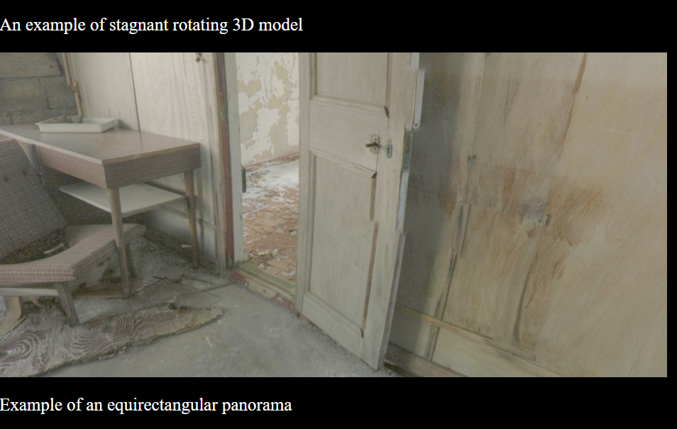
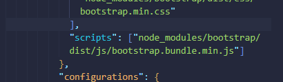
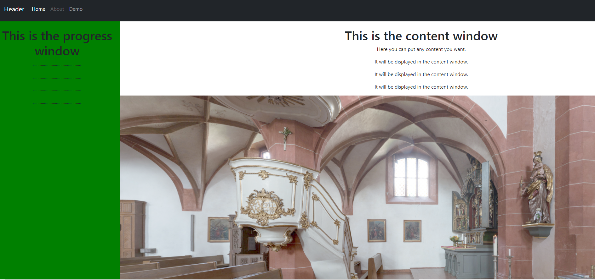
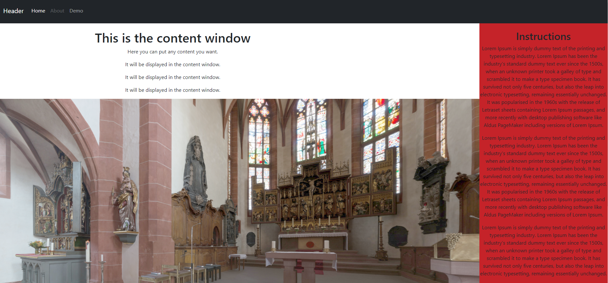
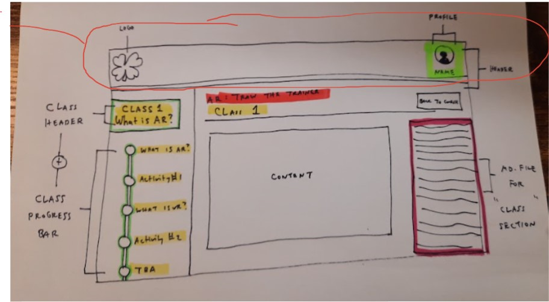
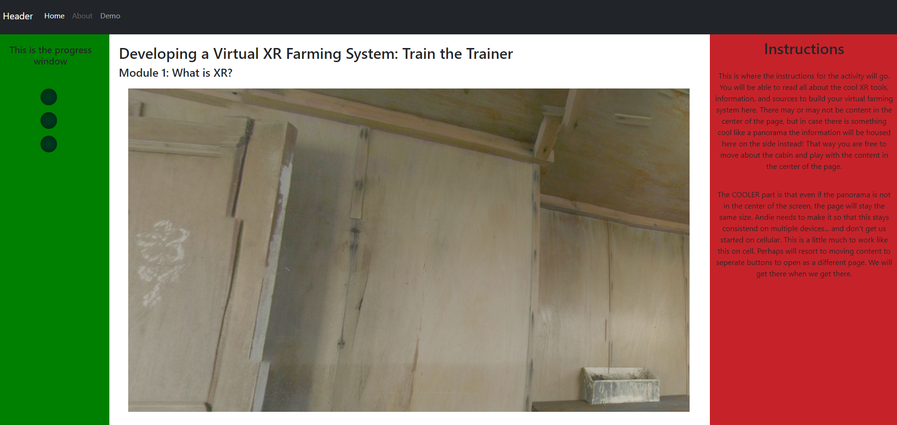
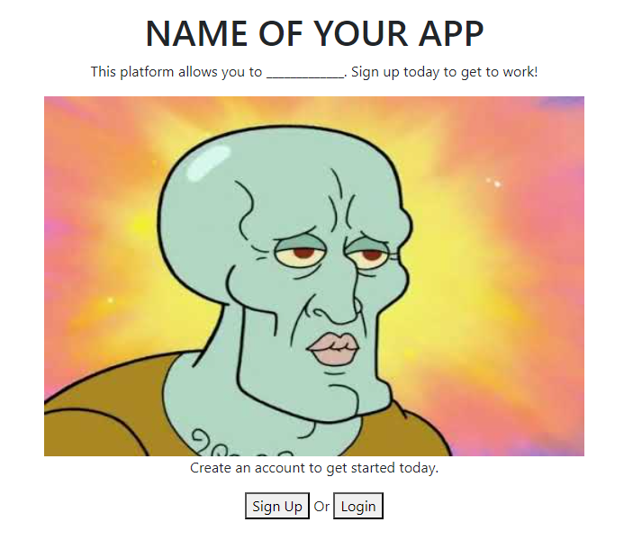
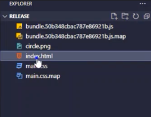
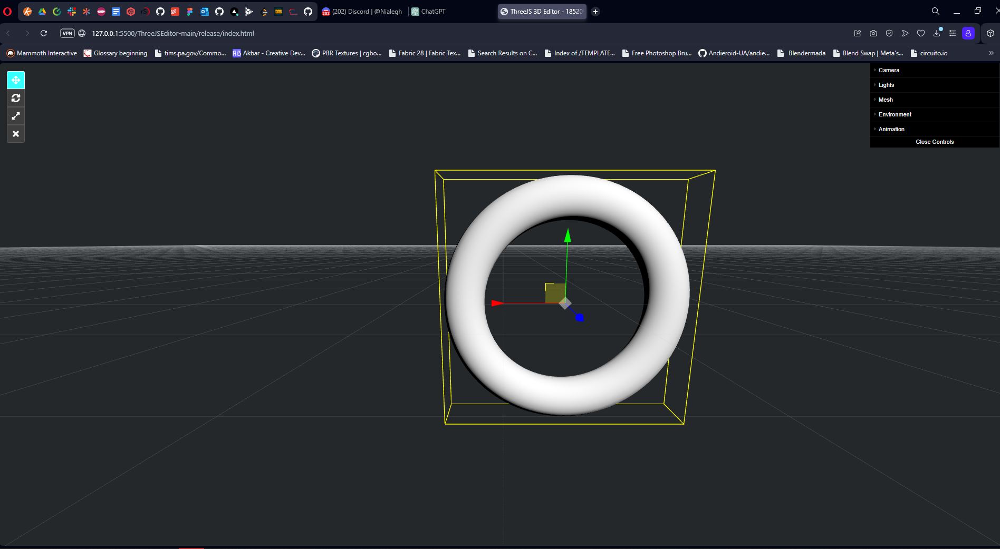
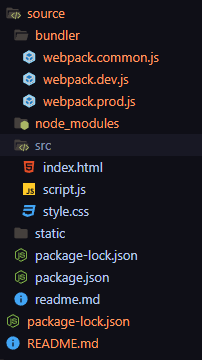

## 11/16/23

https://codepen.io/b007/pen/oNgNxzz

I used inspiration from this one. But it wasn't working. Made a test plain html website to test first. Now trying to fight with Angular to have it run through that.

Also changing background to black because my eyes hurt.

It now works, but with these dimentions it really should be wrapping around like an equirectangular panorama!

https://threejs.org/docs/#api/en/geometries/SphereGeometry

✨✨✨✨✨✨✨✨✨✨✨✨✨✨✨✨✨✨✨✨

✨✨✨✨✨✨✨✨✨✨✨✨✨✨✨✨✨✨✨✨✨

## 11/17/23

Oh sweet. The church test worked!! Now I have a template to work off of. Welp, time to build that website base now that I have two examples.

## 11/18/23

Okie dokie. Going to replace some elements to get a splash page...

## 11/19/23

Going to continue to swap things out. Want this in 4H green with some movable cube placeholders for the time being...
https://getbootstrap.com/docs/5.3/examples/carousel/

*Okay, I'm going to create another branch so I can get these buttons working*

Going off of this tutorial so I know how the button actions are integrated into the carousel...

https://www.youtube.com/watch?v=ku_97a6Bgkg

# 11/20/23

AHAAA!!!!

The issue was the SCRIPTS in the "angular.json" didn't have the bootstrap script. It works now EEEE!! :D

*going to change this to a template. Then work off that template*

I just needed to add this to the app component, and modify the routing, and make a brand new component specifically for the splash page

<router-outlet></router-outlet>

I would like to get started with the layout of that demo page now...

## 11/21/23

Today i'm going to get started with the template of that page!

- Make a component for the demo, need to flush out so it's a "template" to be reused by the project as a whole for "other" modules and classes

WHOOHOO! In trying to organize those cubes on the demo page, I finally found a way to expand the main splash page. Weird how it solves itself like that...

*Note to self, after the layout you want to start to get these things ready*

- login page and fake login icon in the header
- make a firebase thing for the login
- You need to do a test run of that cat app in it's own project, then migrate it over here. Just like you did with that cube. THIS is what's going to make this non-crud since you can  download and upload models. This is the BREAD AND BUTTER of the demo!

## 11/22/23

Okay, I was able to move things around to get this kind of 

I am trying to get something like this below. Will most likely need to make a few more components but this will help emphasize the capability to not only reuse this for the rest of the modules, but to use it across courses as well and essentially make the beginnings of an LMS site.

## 11/24/23

Now that I have the base need to get the following done before the year is out:

- Connect login to Firebase
- Start cat tree project in another project, then merge into this one once it's working (we can customize it LATER)

Got done:
- A login page and splash pages
- Made it so I need to login to see the demo pages

Need:

- Floating element in top right corner as a toggle for parent element. Dialouge Modal

## 11/25/23

Today is the day we get that cat tree app up and running! And then going to Frankenstien it!!

---------------------------------------------------------------

AHA! It looks like the Bower installation thing is a thing... and I can slowly piece together what I need from the library to re-create the editor myself...

Editor/Spline/Geometry
    https://threejs.org/examples/?q=editor#webgl_geometry_spline_editor

Exporter/GLTF
Exporter/OBJ
Exporter/PLY
Exporter/STL
Exporter/USDZ
Exporter/EXR
Exporter/DRACO

------------------------------------------------------------
Bower installation (Bower is a package manager for client-side libraries and components that contain HTML, CSS, JavaScript, fonts, image files, and so on. You can install, locate, upgrade, and remove Bower packages without leaving WebStorm, on the dedicated Bower page or from the command line in the built-in terminal.)
    https://www.jetbrains.com/help/webstorm/using-bower-package-manager.html

Oh nice!! I found this lead to where the 3D models are being stored:
https://bitbucket.org/felis_catus/workspace/repositories/

**********************************

Searching for example projects...

https://github.com/aoobao/threejs-editor

https://github.com/nterms/threejs-editor

https://github.com/holdnewworld/ThreejsBrickEditor/tree/master

https://github.com/AdrianNguyen-UIT/ThreeJSEditor/tree/main

This one... is the CLEANEST. And looks like it gives me bare-bones for getting the project up and running...
https://github.com/AdrianNguyen-UIT/ThreeJSEditor/tree/main/source/src

## 11/26/23

I am resorting to trying out that older project and find that... it is not working when I install Angular. so it looks like it's not an angular project *afterall*

I am attempting to recreate it. Perhaps I should just throw it in a Test Angular project and go from there...

SO IT DOES WORK?!

I just had to go to *the release folder* 🙃

OG Editor here: https://threejs.org/editor/

****

OKAY! Huge discovery!! 

There was a read.me file that mentioned installing the following into the Source folder:

- npm install (node)??
- npm run dev
- npm run build

This also allows me to "build" and access the project files!!

**And, in short, the Angular CLI is still using webpack under the hood so you technically don't need to install it TWICE!
It also looks like the bundler file is created like this:

    To create a webpack.common.js file, you would typically:

    Set up your project directory.
    Install webpack and necessary dependencies (npm install webpack webpack-cli or yarn add webpack webpack-cli).
    Create a webpack.common.js file manually or using tools/scripts.
    Configure the basic settings in this file, such as entry points, output paths, loaders, and plugins.

I don't really know what's going on with that static folder and the sphere image...

And the SRC has the index, js, and css I need to get at least a PLACEHOLDER for the project.

***

Okay, after smashing the library into a more condensed form I am now going to install the following:

    npm install dat.gui

    npm install @tweenjs/tween.js

