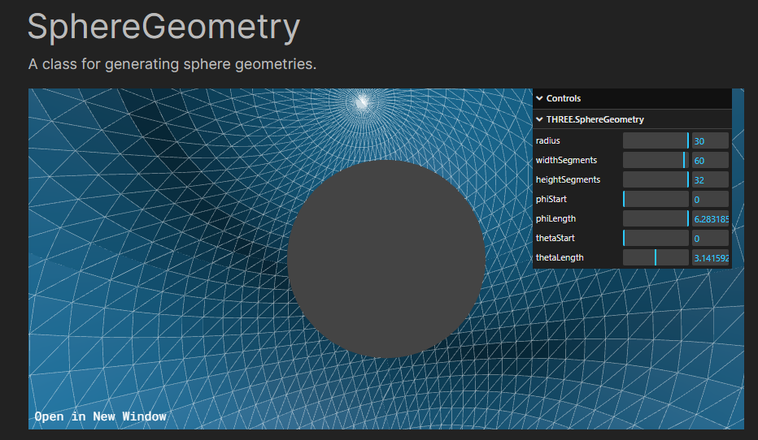

## 11/16/23

https://codepen.io/b007/pen/oNgNxzz

I used inspiration from this one. But it wasn't working. Made a test plain html website to test first. Now trying to fight with Angular to have it run through that.

Also changing background to black because my eyes hurt.

It now works, but with these dimentions it really should be wrapping around like an equirectangular panorama!

https://threejs.org/docs/#api/en/geometries/SphereGeometry

✨✨✨✨✨✨✨✨✨✨✨✨✨✨✨✨✨✨✨✨

✨✨✨✨✨✨✨✨✨✨✨✨✨✨✨✨✨✨✨✨✨

## 11/17/23

Oh sweet. The church test worked!! Now I have a template to work off of. Welp, time to build that website base now that I have two examples.