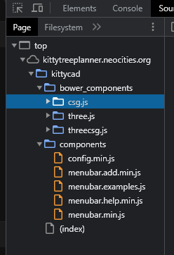

# We are going to attempt to reverse-engineer this site

https://kittytreeplanner.neocities.org/kittycad/

#### Let's breakdown what is in the files...

## 1. Uncovering the bower_components

#### csg.js
https://www.npmjs.com/package/csg

#### three.js
https://www.npmjs.com/package/three

#### threecsg.js
https://www.npmjs.com/package/three-csg-ts

## 2. The altered components

config.min.js
menubar.add.min.js
menubar.examples.js
menubar.help.min.js
menubar.min.js

So these files have been altered to fit the purpose of the cat-tree app

## 3. Index file

*I am still getting to know this file*

## 4. Storage Online

Oh nice!! I found this lead to where the 3D models are being stored:
https://bitbucket.org/felis_catus/workspace/repositories/

OH MY GODS I FOUND THE EDITOR!!:
https://threejs.org/editor/

It was originally found HERE!
http://benchung.com/using-three-js-editor/

Oh wow, this is what I've needed to find information on...
https://www.youtube.com/watch?v=DcDbRQUSbsw

